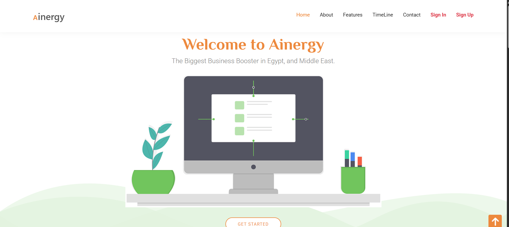

# Ainergy Landing Page

A fully responsive and modern landing page for a fictional energy company called **Ainergy**. Built using semantic HTML, modular CSS, and vanilla JavaScript.

## 🔗 Live Demo
[Visit Live Site](https://momen-sayed0.github.io/Ainergy)

## 📂 Repository
[View on GitHub](https://github.com/momen-sayed0/Ainergy)

---

## 🛠️ Built With

- HTML5
- CSS3 (Mobile-first)
- JavaScript (Vanilla JS)
- Flexbox & Media Queries

---

## ✨ Features

- Responsive layout across all devices.
- Smooth animations and transitions.
- Semantic and accessible HTML structure.
- Clean and organized codebase.

---

## 📷 Screenshot

---

## 🧑‍💻 Author

**El Mo'men Bellah Sayed**  
[GitHub Profile](https://github.com/momen-sayed0)

---

## 📌 License

This project is open-source and free to use.
